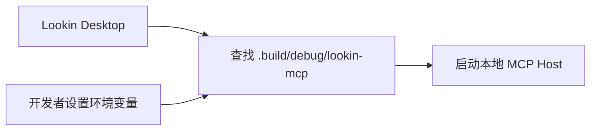
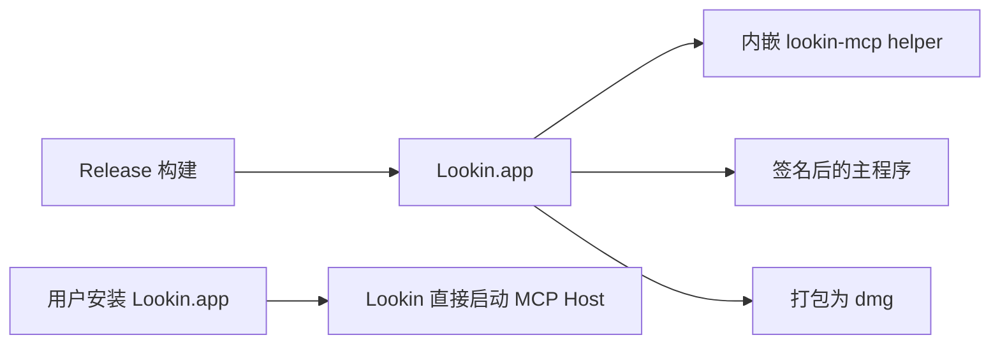
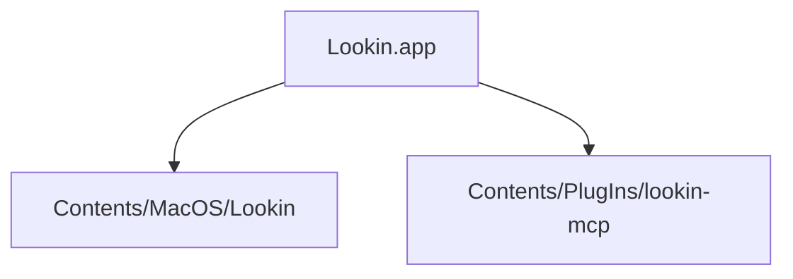
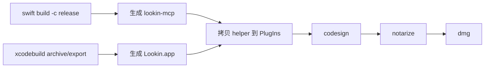

## Context

当前仓库已经完成了桌面端托管 MCP host 的主路径，但交付形态仍然是开发态：

这条链路适合仓库内调试，却不适合外部用户安装，因为它依赖源码目录、Swift toolchain 和本地构建产物。要让 “下载 dmg -> 拖入 Applications -> 打开 Lookin -> 配置 MCP client” 成为默认路径，就需要把 MCP helper 视为 Lookin 发布包的一部分，而不是外部前置条件。

## Goals / Non-Goals

**Goals:**
- 让 Lookin.app 在发布态内嵌 `lookin-mcp` helper，不再要求用户执行 `swift build`。
- 让桌面 MCP host 在发布态优先从 app bundle 内解析 helper，同时保留开发态 fallback。
- 提供一条明确的 release 产物链路，至少覆盖自包含 app 与 dmg 打包。
- 明确主 app 与 helper 的签名、错误暴露和安装文档要求。

**Non-Goals:**
- 不在本 change 中引入自动更新、版本检查或 license 校验。
- 不在本 change 中改变 MCP tool contract、snapshot 结构或 UI 分析能力边界。
- 不在本 change 中建设跨平台安装器；第一版只覆盖 macOS Lookin.app / dmg 分发。
- 不在本 change 中处理企业级证书托管细节，只定义需要接入的签名与 notarize 钩子。

## Decisions

### 1. 将 `lookin-mcp` 作为 app bundle 内嵌 helper 发布

发布态结构统一为：

原因：
- `LKMCPHostManager` 已经具备从 `builtInPlugInsPath` 解析 helper 的入口，和当前实现兼容。
- 使用单一 app bundle 交付，用户安装路径最短。
- helper 生命周期继续由主 app 管理，不额外引入 daemon、launch agent 或独立安装器。

备选方案：
- 把 helper 放在 app 外部目录。拒绝原因是安装后路径不稳定，签名关系也更脆弱。
- 把 helper 做成独立 app。拒绝原因是用户心智更重，且不需要额外 UI 宿主。

### 2. 运行时解析顺序采用“发布优先，开发兜底”

解析顺序定义为：

1. `LOOKIN_MCP_EXECUTABLE`
2. `Lookin.app/Contents/PlugIns/lookin-mcp`
3. 仓库内 `.build/debug/lookin-mcp` 及其相对路径候选

原因：
- 开发者仍然可以显式覆盖 helper，用于调试未发布版本。
- 外部用户默认命中 app 内嵌 helper，不需要知道仓库结构。
- 运行时行为更可预测，避免发布版误依赖本地源码目录。

备选方案：
- 保持当前“环境变量 / 仓库路径优先”。拒绝原因是正式安装后仍可能解析失败。

### 3. Release 构建拆成三步，而不是把所有逻辑塞进 Xcode scheme

推荐链路：

原因：
- `lookin-mcp` 来自 Swift Package，Lookin 主程序来自 Xcode 工程，构建系统本来就分离。
- 用显式脚本串联更容易复现，也更适合 CI。
- 签名与 notarize 可以围绕“最终 app bundle”统一执行。

备选方案：
- 完全依赖手工 Xcode 操作。拒绝原因是无法稳定复现。
- 把 helper 再迁移进 Xcode target。第一版拒绝，因为改动面更大，收益有限。

### 4. 主 app 与 helper 必须视为同一发布单元签名

要求：
- helper 拷贝进 bundle 后再统一签名
- 状态面板中的错误信息要能区分“helper 缺失”“helper 不可执行”“helper 启动失败”

原因：
- macOS 发布环境下，未签名或签名失配的内嵌二进制会直接破坏启动路径。
- 用户需要知道是“服务错误”还是“安装包错误”。

### 5. 文档主路径切换为安装型接入

README 和安装文档应把默认接入流程改成：

1. 下载 app / dmg
2. 安装并启动 Lookin
3. 确认顶部 MCP 状态就绪
4. 在 MCP client 中连接 `http://127.0.0.1:3846/mcp`

源码构建保留为开发者路径，而不是默认用户文档首页。

## Risks / Trade-offs

- [发布脚本变长] -> 构建链路同时包含 SwiftPM 与 Xcode  
  缓解：脚本化并输出明确的中间产物路径与失败日志。

- [签名顺序错误] -> app 可启动但 helper 无法执行  
  缓解：把 helper 拷贝、可执行位修正、codesign 校验作为固定流水线步骤。

- [开发态与发布态路径冲突] -> 本机误用了旧的 `.build/debug` helper  
  缓解：调整解析优先级，并在状态日志中输出实际命中的 helper 路径。

- [notarize 未就绪] -> 第一版只能本地签名测试，不能公开分发  
  缓解：先把 notarize 接口与脚本钩子设计好，允许证书后补。

- [dmg 成为唯一发布产物] -> 调试用户拿不到裸 app 包  
  缓解：同时保留 `.app` 与 `.dmg` 两类产物，dmg 只是默认分发形式。

## Migration Plan

1. 调整 `LKMCPHostManager` 的 helper 解析优先级，优先命中 app bundle 内嵌路径。
2. 增加 release helper 构建与拷贝脚本，将 `lookin-mcp` 放入 `Lookin.app/Contents/PlugIns/`。
3. 增加打包脚本，串联 app 导出、helper 注入、签名校验和 dmg 生成。
4. 更新 README 与安装文档，将“直接安装 app / dmg”改为默认接入路径。
5. 在至少一台未安装 Swift toolchain 的机器上验证：仅安装 app 也能成功启动 MCP host。

回滚方式：
- 保留开发态 fallback，因此即使发布打包链路暂时不可用，仓库内调试路径仍可继续使用。
- 如果内嵌 helper 方案引入发布阻塞，可暂时关闭打包脚本，不影响现有源码构建与调试。

## Open Questions

- helper 最终是否保留在 `Contents/PlugIns/`，还是要迁移到 `Contents/Helpers/` 以贴近 macOS 常见约定？
- notarize 所需的 Apple Developer 签名资料由谁持有，是否要先设计 CI secrets 约定？
- 第一版 dmg 是否需要包含额外的客户端配置片段文件，还是只保留文档说明？
