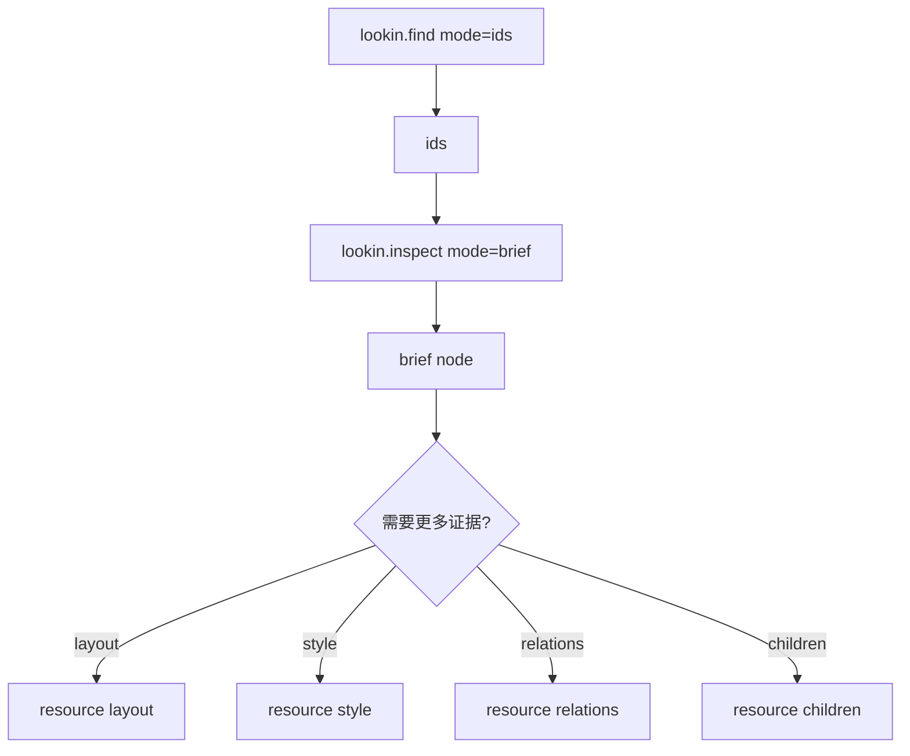

## Context

现有 surface 已经把 tools 收敛为 `screen/find/inspect/capture/raw`，并通过 resources 暴露重数据。但实际查询中，低 token 目标还没有完全达成：

- `find` 默认仍返回 frame、hidden、alpha、layout 等候选详情。
- `inspect` 默认仍返回 layout 证据、长字段名和多条 resource 描述。
- subtree 只有 `max_nodes` 截断，没有继续读取的 cursor。
- 每次 tool 返回都重复描述 URI 和下一步入口。

本变更目标是把一次查询拆成“定位 -> brief -> section evidence”，让模型多次小查询，而不是一次吃大对象。

## Goals / Non-Goals

**Goals:**

- 让查找节点的默认 token 成本接近 ID 列表，而不是节点详情列表。
- 让查看节点的默认 token 成本接近 brief 视图，而不是证据视图。
- 让 layout、style、relations、children、subtree、capture 按 section 读取。
- 让列表型 section 支持分页或游标。
- 保留现有 compact/standard/full 兼容路径。

**Non-Goals:**

- 不改变 Lookin Desktop 导出 snapshot 的格式。
- 不改变 iOS 端连接或采集流程。
- 不在本变更中新增写操作或修改 UI 属性能力。
- 不要求第一版删除所有长字段响应。

## Decisions

### 1. 新增 mode，而不是继续放大 detail

推荐参数：

- `mode=ids`: 只返回匹配节点 ID 与必要计数。
- `mode=brief`: 返回单个节点的身份和几何摘要。
- `mode=evidence`: 显式返回指定证据 section。



原因：

- `detail=compact` 语义已经包含“少量证据”，继续压缩会破坏兼容预期。
- `mode` 更适合表达“返回形态”，`detail` 继续表达“证据详细程度”。

### 2. 提供短字段响应格式

短字段仅用于低 token 模式：

| 短字段 | 含义 |
|---|---|
| `sid` | `snapshot_id` |
| `id` | `node_id` |
| `cls` | `class_name` |
| `raw` | `raw_class_name` |
| `vc` | `host_view_controller_name` |
| `f` | `[x, y, width, height]` |
| `ch` | `child_count` |
| `p` | `parent_id` |
| `n` | `nodes` |

数组化 frame 统一保留 2 位小数。例如：

```json
{
  "sid": "20260422T110250Z",
  "id": "oid:47",
  "cls": "ERCanvasImageView",
  "raw": "Collage_dev.ERCanvasImageView",
  "vc": "EREditVC",
  "f": [109.36, 242.82, 193.33, 344.33]
}
```

### 3. URI 模板固定化，避免每次返回 resource_links

低 token 模式不默认返回 `resource_links` 数组。客户端通过固定模板组合：

- `lookin://snapshots/{sid}/nodes/{id}/layout`
- `lookin://snapshots/{sid}/nodes/{id}/style`
- `lookin://snapshots/{sid}/nodes/{id}/relations`
- `lookin://snapshots/{sid}/nodes/{id}/children?limit=20&cursor=...`
- `lookin://snapshots/{sid}/nodes/{id}/siblings?limit=20&cursor=...`
- `lookin://snapshots/{sid}/nodes/{id}/subtree?depth=1&limit=40&cursor=...`
- `lookin://snapshots/{sid}/nodes/{id}/capture?padding=8`

原因：

- URI 规则是协议知识，不应在每次响应里重复解释。
- 如果客户端需要可读描述，仍可使用现有 compact/standard/full 返回。

### 4. section evidence 独立读取

section 返回应当只包含请求的证据，不混入其他字段：

- `layout`: intrinsic size、constraints、hugging、compression resistance。
- `style`: opacity、background、border、corner、shadow、tint。
- `relations`: parent、ancestors、siblings summary、parent insets。
- `children`: 直接子节点 summary，必须支持分页。
- `subtree`: 局部树，必须支持 depth、limit、cursor。

### 5. 分页协议必须稳定

列表型响应统一返回：

```json
{
  "sid": "20260422T110250Z",
  "id": "oid:47",
  "n": [],
  "next": null
}
```

如果还有后续：

```json
{
  "sid": "20260422T110250Z",
  "id": "oid:40",
  "n": [{"id": "oid:47", "cls": "ERCanvasImageView"}],
  "next": "cursor-token"
}
```

cursor 可以是稳定的节点序号或编码后的偏移，但不能暴露本地文件路径。

## Risks / Trade-offs

- [可读性下降] -> 短字段不适合人工调试  
  缓解：保留现有可读 JSON，低 token 模式仅用于 LLM 默认路径。

- [客户端需要知道协议模板] -> 不能完全靠响应自描述  
  缓解：在 tool 描述、docs 和 prompts 中固定说明短字段和 URI 模板。

- [模式增多] -> 参数复杂度上升  
  缓解：只定义 `ids/brief/evidence` 三种模式，避免继续扩散。

- [证据不足导致多次查询] -> 请求次数增加  
  缓解：这是本变更的刻意取舍；token 成本由调用方按需放大。

## Migration Plan

1. 新增短字段模型和 frame 数组化 helper。
2. 为 `lookin.find` 增加 `mode=ids`，默认推荐返回 ID 列表。
3. 为 `lookin.inspect` 增加 `mode=brief/evidence`，默认推荐 brief。
4. 扩展 resources/read 支持 layout、style、relations、children、siblings、subtree cursor。
5. 更新 docs 和 prompts，推荐“find ids -> inspect brief -> read section”路径。
6. 添加 token 预算测试，确保典型 `find + inspect` 查询相对当前 compact 至少降低 50%。

## Open Questions

- 第一版是否直接把 `find` 默认切到 `mode=ids`，还是先要求客户端显式传 `mode=ids`？
- 短字段是否只用于 tools，还是 resources/read 的 section 也统一短字段？
- token 预算测试应使用固定 tokenizer 近似值，还是只验证响应字节数上限？
