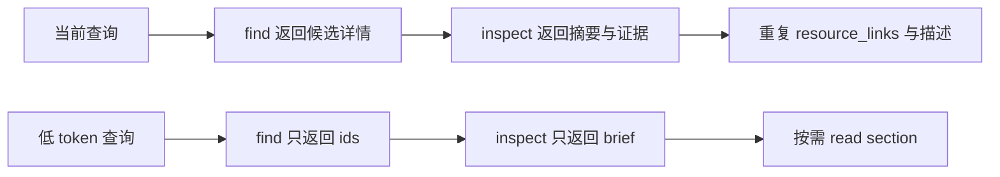

## Why

当前 Lookin MCP 已经采用 compact-first，但一次查询仍会重复返回节点摘要、证据字段、resource 描述和展开入口，查看一个具体节点时仍会消耗较多 token。以当前 snapshot 中 `Collage_dev.ERCanvasImageView` 为例，`find + inspect` 当前约 880 tokens；如果改为短字段和按 section 展开，预计可降到 110-150 tokens。

## What Changes

- 新增低 token 查询模式，允许 `lookin.find` 默认或显式返回 `mode=ids` 的候选 ID 列表。
- 新增节点 brief 返回形态，允许 `lookin.inspect` 在 `mode=brief` 下只返回身份、VC、短 class 与数组化 frame。
- 新增 `mode=evidence` 或等价参数，用于显式读取 layout、style、relations、children 等证据 section。
- 新增短字段响应格式，使用稳定字段别名，例如 `sid`、`id`、`cls`、`raw`、`vc`、`f`。
- 将固定 URI 模板从每次 tool 返回中移出，默认只返回必要 ID；客户端按约定组合 section resource。
- 为 children、siblings、subtree 等列表型 section 增加分页或游标语义，避免通过放大 `max_nodes` 重读。
- 不移除现有 compact/standard/full；低 token 模式作为新的默认推荐路径或兼容参数逐步启用。

## Capabilities

### New Capabilities

- `lookin-mcp-low-token-query-mode`: 定义 Lookin MCP 面向 LLM 的低 token 查询协议，包括 ids/brief/evidence 模式、短字段响应、section 级按需读取和分页展开。

### Modified Capabilities

- `lookin-mcp-analysis-surface`: 调整现有 compact-first 工具面的默认返回策略，使其支持更激进的低 token 查询模式，并避免默认重复返回 resource 描述和证据字段。

## Impact

- 影响 `Sources/LookinMCPServer/MCPRequestHandler.swift` 的 tool schema、参数解析和响应 payload。
- 影响 `Sources/LookinMCPServer/MCPSurfaceSupport.swift` 的响应模型、短字段模型和 resource URI helper。
- 影响 `Sources/LookinMCPServer/LocalSnapshotStore.swift` 的 children、siblings、subtree 分页查询能力。
- 影响 `Tests/LookinMCPServerTests/LookinMCPServerTests.swift`，需要新增 token 预算、短字段响应和分页查询测试。
- 影响 `docs/LLM使用Prompt.md` 与 MCP 接入文档，需要更新推荐调用路径。
