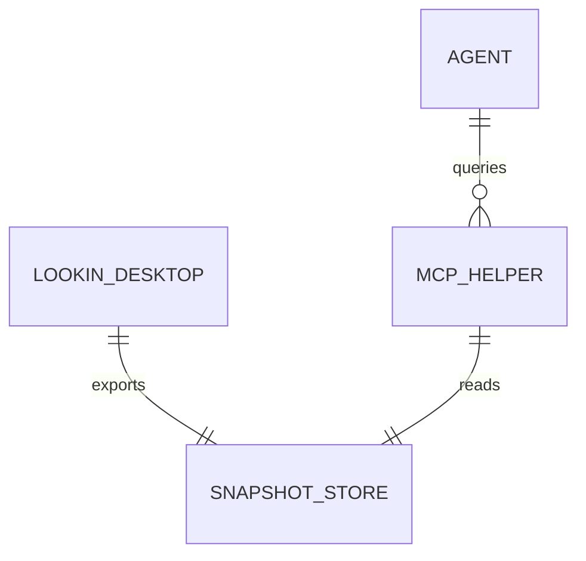
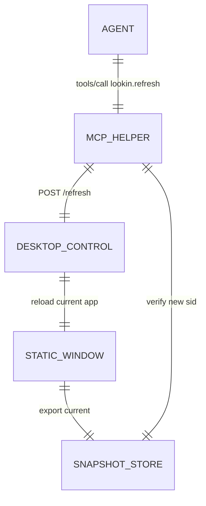

## Context

当前结构是“Lookin Desktop 写 snapshot，MCP helper 只读 snapshot”：



这个结构保证了查询低风险，但也让 agent 无法主动刷新。刷新必须回到 Lookin Desktop 主进程，因为真正的 `fetchHierarchyData`、detail 补全、AppKit 状态和 snapshot export 都在 GUI 侧。

## Goals / Non-Goals

**Goals:**

- agent 可以通过 MCP 主动刷新当前 inspecting app 页面。
- tool 返回时必须明确刷新已到达 `hierarchy` 或 `details` 阶段。
- 默认响应保持低 token，只返回后续查询所需的最小 ID 和状态字段。
- 复用现有 Lookin reload 与 snapshot export 流程，避免新建第二套 iOS 连接逻辑。

**Non-Goals:**

- 不让 `lookin.refresh` 返回 screen 摘要或节点详情。
- 不支持多 app 并发刷新。
- 不通过 MCP 修改目标 app 状态。
- 不重写 Lookin iOS 连接协议。

## Decisions

### 1. `lookin.refresh` 是动作工具，不是查询工具

默认 payload：

```json
{
  "ok": true,
  "sid": "20260511T123456Z",
  "prev_sid": "20260511T123300Z",
  "phase": "details",
  "changed": true,
  "ms": 1842
}
```

原因：
- 和已有低 token 查询模式一致，tool 返回必要 ID，重对象按需读取。
- 避免刷新后马上强制消耗 screen/tree token。

备选方案：刷新后直接返回 `lookin.screen` compact 摘要。拒绝原因是很多任务刷新后会直接按目标 `find(mode=ids)`，screen 摘要会变成重复 token。

### 2. MCP helper 通过本机控制接口请求 Lookin Desktop 刷新



原因：
- helper 是独立进程，不能直接调用 AppKit controller。
- 本机控制接口能让刷新请求在主线程安全进入现有 GUI reload 流程。

备选方案：helper 轮询 snapshot 文件并提示用户手动刷新。拒绝原因是不能满足“agent 自己刷新”的目标，也不能可靠返回完成时机。

### 3. 完成阶段分为 `hierarchy` 和 `details`

- `hierarchy`：`fetchHierarchyData` 完成并导出新 snapshot。
- `details`：detail/screenshot 异步补全结束后再次导出 snapshot。

默认 `wait_until=details`。如果没有 detail 任务，`details` 可以退化为 hierarchy 完成后的 snapshot。

原因：
- `details` 提供更完整视觉证据，适合默认 agent 分析。
- `hierarchy` 保留给只需要结构变化的低延迟场景。

备选方案：只定义一个“刷新完成”。拒绝原因是 Lookin 现有流程天然分两段，混在一起会让 agent 不知道 screenshot/detail 是否可用。

### 4. 超时也要返回已知阶段

刷新超时时，tool 应返回错误或 `ok=false`，并包含已经到达的阶段、旧 snapshot id、新 snapshot id（如果已产生）和耗时。

原因：
- agent 可以决定是否先看 hierarchy，还是继续等待/重试。

## Risks / Trade-offs

- [控制接口误暴露] -> 只监听 `127.0.0.1`，并限制为刷新动作，不开放任意命令。
- [刷新请求与用户手动刷新冲突] -> 如果正在刷新，返回 busy/timeout 语义，不强行取消用户操作。
- [detail 阶段过慢] -> 支持 `timeout_ms` 和 `wait_until=hierarchy`。
- [snapshot id 未变化] -> 返回 `changed=false`，让 agent 能判断目标页面可能没有变化或刷新未产生新文件。

## Migration Plan

1. 新增 Desktop 控制入口，接到刷新请求后调度现有 reload 流程。
2. 在 reload hierarchy 完成和 detail 完成两个点记录刷新请求完成状态。
3. MCP helper 新增 `lookin.refresh` tool，调用 Desktop 控制入口并返回 ids-only payload。
4. 补充测试与文档。
5. 如控制入口不可用，`lookin.refresh` 返回明确错误，现有只读 tools 不受影响。
