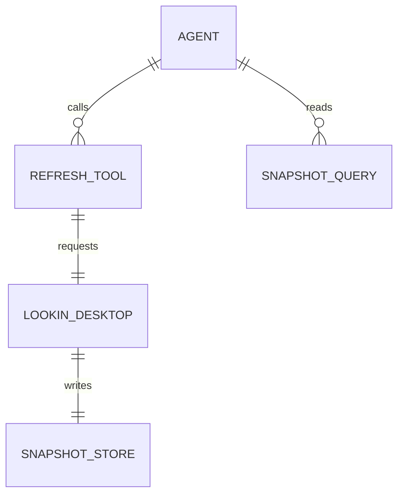

## Why

当前 MCP surface 只能读取 Lookin Desktop 已经导出的本地 snapshot。agent 打开新页面后，如果 Lookin 还停留在旧 snapshot，agent 必须依赖用户手动刷新，无法自己获取最新 UI 现场。

这个 change 需要补齐一个低 token 的刷新动作：agent 能触发当前页面刷新，并在明确完成阶段后拿到新的 snapshot id，再按需调用 `screen/find/inspect`。

## What Changes

- 新增 `lookin.refresh` MCP tool，用于触发当前 inspecting app 的页面刷新。
- `lookin.refresh` 默认返回 ids-only 结果，只包含完成状态、新旧 snapshot id、完成阶段、是否变化和耗时。
- 支持 `wait_until=hierarchy|details`，让 agent 知道返回时刷新完成到哪一阶段。
- 新增 Lookin Desktop 本机控制入口，供 MCP helper 请求 GUI 主进程执行 reload。
- 保持刷新动作与页面查询分离，不在刷新结果中默认内联 screen 摘要、节点摘要、截图元数据或 resource URI 模板。

## Capabilities

### New Capabilities

- `lookin-mcp-refresh-tool`: 定义 agent 通过 MCP 触发 Lookin Desktop 刷新当前页面，并以低 token 响应拿到刷新完成时机与新 snapshot id。

### Modified Capabilities

- `lookin-desktop-mcp-host`: 本地 host 需要能把刷新请求转发给 Lookin Desktop 主进程，但不改变已有 snapshot reader 查询语义。

## Impact

- 影响 `Sources/LookinMCPServer/` 的 tool schema、tool dispatch、低 token payload 和 HTTP/control client。
- 影响 `Lookin/LookinClient/` 的 MCP host manager 与 static window reload 流程，需要新增本机控制端点或等价桥接。
- 影响 README / MCP 接入文档，需要说明推荐调用顺序：`lookin.refresh(mode=ids)` 后按需调用 `screen/find/inspect`。
- 需要补充 Swift MCP handler 测试和桌面控制入口的可验证行为。
