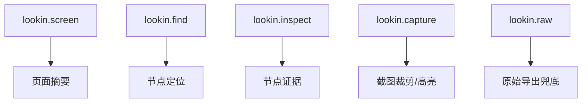

## Context

当前 Lookin Desktop 已能托管本地 MCP host，但协议面基本等同于“把 snapshot reader 包成一组 tools”：

这种做法能工作，但与 MCP 官方建议不完全一致。官方更强调：
- tools 用于动作与查询入口；
- resources 用于承载大块上下文；
- prompts 用于承载可复用工作流。

Lookin 的真实场景又刚好符合这种分层：LLM 先定位节点，再决定是否读取 subtree、截图或 raw snapshot，最后按提示模板产出分析结论。

## Goals / Non-Goals

**Goals:**
- 把对外 tools 控制在 5 个以内，并让名字和职责足够稳定。
- 默认只返回 compact 摘要，让大对象改为通过 resources 按需读取。
- 为常见 UI 诊断场景提供 prompts，减少每次都手写分析步骤。
- 保持底层仍复用现有本地 snapshot 数据，而不是重新接入 iOS 端。

**Non-Goals:**
- 不改变 Lookin 当前 snapshot 采集来源和桌面端托管模型。
- 不在本次 change 中新增写操作、属性修改或远程执行能力。
- 不追求第一版覆盖所有诊断工作流，只覆盖最常见的布局与视觉分析。

## Decisions

### 1. 对外收敛为 5 个固定 tools

最终对外 tools 定义为：

原因：
- 名称短，便于模型记忆和自动调用。
- 覆盖“看页面、找节点、看细节、看图、兜底导出”五类核心动作。
- 可以吸收当前 `find_nodes`、`get_node_details`、`get_node_relations`、`get_subtree`、`crop_screenshot`、`query_snapshot` 等能力。

备选方案：
- 保留现有 8 个 tools。拒绝原因是 surface 过宽，模型选择成本高。
- 压缩到 3 个 mega-tools。拒绝原因是单个 tool 语义过重，参数会重新膨胀。

### 2. 大对象一律迁移到 resources

resources 负责承载：
- 当前 snapshot 摘要
- 当前 snapshot 全量 JSON
- 指定节点 subtree
- 全屏截图
- 指定节点裁剪图

推荐 URI 形态：
- `lookin://snapshots/current/summary`
- `lookin://snapshots/current/raw`
- `lookin://snapshots/{snapshot_id}/nodes/{node_id}/subtree`
- `lookin://snapshots/{snapshot_id}/screenshot`
- `lookin://snapshots/{snapshot_id}/nodes/{node_id}/capture`

原因：
- 这些内容天然是“可读取上下文”，不是“动作”。
- 让工具返回 `summary + resourceLinks`，可以显著降低默认 token 成本。

备选方案：
- 继续通过 tools 直接返回大块 JSON。拒绝原因是模型每次都被迫吞下完整对象。

### 3. prompts 只承载工作流，不承载底层数据

第一版 prompts 建议提供：
- `analyze-node-layout`
- `analyze-node-visual-style`
- `diagnose-spacing-and-alignment`

每个 prompt 只接收少量参数，例如 `snapshot_id`、`node_id`、`focus`，再引导客户端组合 `screen/find/inspect/resource`。

原因：
- prompts 适合承载“怎么分析”，不适合承载“底层返回什么”。
- 可以让 LLM 更稳定地复用同一套 UI 诊断路径。

### 4. 所有 tool 默认 compact-first

统一引入：
- `detail: compact | standard | full`
- `include: ["layout", "style", "relations", "children"]`

默认行为：
- `compact` 只返回定位必需字段、关键布局证据和 resource 引用
- `full` 才允许附带更完整的节点与树信息

原因：
- token 成本应当由调用方显式放大，而不是默认放大。
- 让“先定位、后展开”成为协议默认路径。

### 5. host capability 必须显式声明 tools/resources/prompts

桌面端 host 在 `initialize` 返回中必须同时声明：
- `tools`
- `resources`
- `prompts`

并实现配套的：
- `resources/list`
- `resources/read`
- `prompts/list`
- `prompts/get`

原因：
- 这才符合 MCP 官方 primitive 的完整暴露方式。
- 客户端能更明确地区分“可自动调用的动作”和“按需读取的上下文”。

## Risks / Trade-offs

- [客户端兼容性破坏] -> 旧 tool 名称会失效  
  缓解：在 README 与接入文档中提供明确迁移表，并在错误消息中提示替代入口。

- [resources 数量变多] -> URI 设计不稳定会导致后续难以兼容  
  缓解：首版只开放少量稳定 URI 模式，不把内部文件路径直接暴露给客户端。

- [prompt 过多] -> 模型仍可能拿到很多说明文本  
  缓解：第一版 prompts 控制在 3 个以内，只覆盖高频分析场景。

- [compact 信息不足] -> 模型仍需频繁二次读取  
  缓解：`inspect` 默认补充关键布局与样式证据，并允许按 `include` 精细扩展。

## Migration Plan

1. 定义新的 tool/resource/prompt contract，并完成旧工具到新 surface 的映射表。
2. 在服务端实现 `resources/list/read` 与 `prompts/list/get`，同时改造 `initialize` capability。
3. 将现有细粒度 tool 逻辑下沉为内部适配函数，由新的 5 个 tools 统一调度。
4. 更新 README、LLM prompt 文档与安装接入指南，默认推荐新 surface。
5. 用现有测试与新增协议测试验证：默认返回更小、重数据可经 resources 读取、常见 prompt 可跑通。

回滚方式：
- 保留内部旧适配逻辑，不立即删除底层实现。
- 如新 surface 出现阻塞，可临时恢复旧 tool 注册表，再单独迭代 resources/prompts。

## Open Questions

- `lookin.raw` 是否保留为公开 tool，还是在客户端成熟后完全改为 resource-only 入口？
- screenshot 资源是返回本地文件 URI、MCP embedded resource，还是两者都支持？
- prompts 是否需要附带“推荐调用顺序”，还是仅输出任务说明与参数模板？
