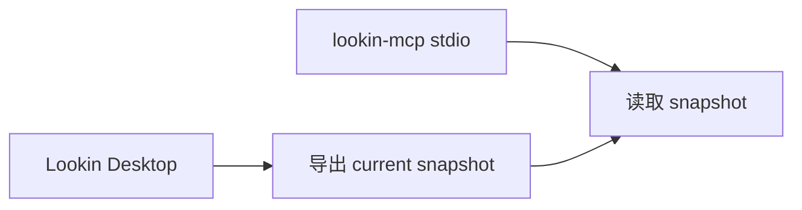
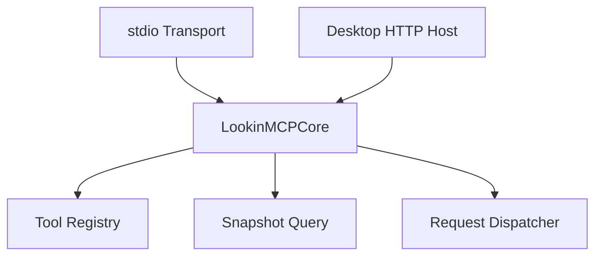
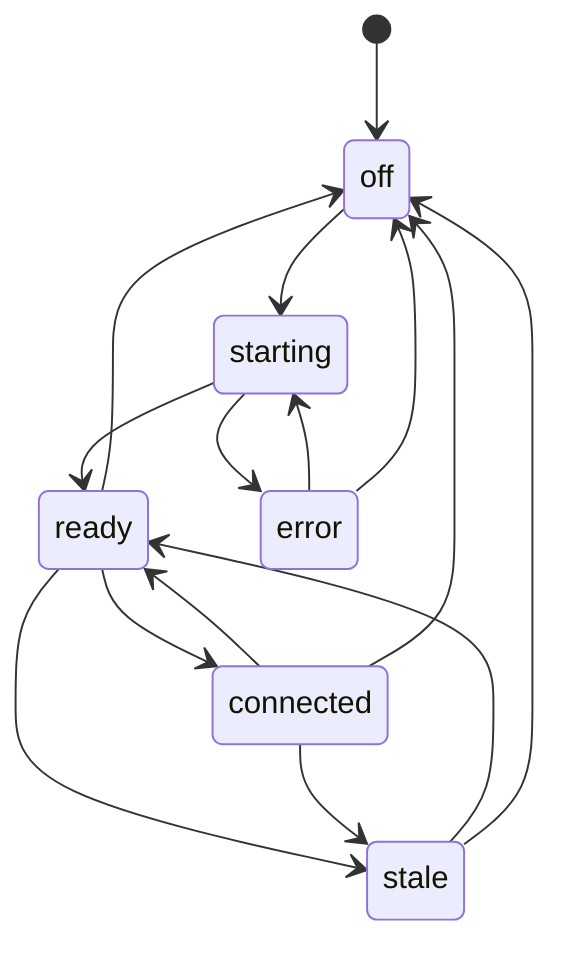

## Context

当前已有能力链路如下：

这条链路已经能支撑 `find_nodes`、`get_node_details`、`get_node_relations`、`get_subtree` 和 `crop_screenshot`，但服务宿主仍在 Lookin 之外。结果是：

- `stdio` 生命周期与外部客户端绑定，稳定性弱。
- Lookin UI 无法表达“服务是否启动、有没有请求、snapshot 是否过期”。
- 用户需要记住“Lookin 负责导出，CLI 负责启动 MCP”，产品感割裂。

当前讨论已经明确选择方案 B：由 Lookin Desktop 托管本地 HTTP MCP host，并在 toolbar 中直接展示工作状态。

## Goals / Non-Goals

**Goals:**
- 让 Lookin Desktop 自己托管本地 MCP host，对外暴露稳定的 localhost MCP 地址。
- 复用现有 snapshot reader 工具能力，不改变数据源边界。
- 在 toolbar 中新增 MCP 状态入口，显示服务健康度、snapshot 时效、最近请求和最近错误。
- 明确 Lookin 重启后的恢复行为：服务会短暂不可用，但客户端可基于固定地址重连。

**Non-Goals:**
- 不在本 change 中增加新的 UI 分析 tool 能力。
- 不在本 change 中引入远程云托管 MCP server。
- 不在本 change 中支持多端共享状态或账号体系。
- 不在本 change 中支持控制 iOS UI、调用方法或写回属性。

## Decisions

### 1. 采用 Lookin Desktop 托管的本地 HTTP MCP host，而不是继续沿用纯 `stdio`

选择本地 HTTP host，而不是把 `stdio` 进程直接嵌进 toolbar 行为。

原因：
- `stdio` 会话天然脆弱，Lookin 重启即断。
- 客户端连接固定 localhost 地址，比管理一次性 pipe 更稳定。
- toolbar 状态可以围绕“host 是否就绪、是否有请求”建立真实模型。

备选方案：
- 继续保持独立 `stdio` CLI。拒绝原因是无法提供产品级稳定性和桌面状态感知。
- 引入独立 daemon。拒绝原因是第一版会增加额外安装和跨进程协调复杂度。

### 2. 把 MCP 分为 core 与 transport 两层

原因：
- 保留现有 `lookin-mcp` 调试入口。
- 新增桌面 host 时，不需要复制工具实现。
- 后续如需更多 transport，不影响工具 contract。

### 3. Toolbar 状态采用有限状态机，而不是只看进程是否存活

状态定义：

- `off`：服务未启用
- `starting`：服务启动中
- `ready`：服务可用，snapshot 可读
- `connected`：最近存在 MCP 请求
- `stale`：snapshot 可读但超过新鲜度阈值
- `error`：启动失败、端口占用或最近请求异常

原因：
- “服务已启动”不等于“当前数据可用”。
- 用户更关心“我现在能不能让 LLM 用”。

### 4. 使用固定默认端口和明确错误，而不是静默切随机端口

第一版使用固定 localhost 地址，例如 `127.0.0.1:3846`。

原因：
- 客户端配置简单稳定。
- 端口冲突时应显式展示错误，让用户知道配置为何不可用。

备选方案：
- 自动切换随机端口。拒绝原因是客户端配置会漂移，toolbar 也更难表达。

### 5. Toolbar MCP 按钮点击后打开 popover，而不是只做图标状态

popover 内容包含：
- 当前 host 状态
- 当前服务地址
- 最近 snapshot 时间
- 最近请求时间
- 最近错误
- 启动 / 停止 / 复制地址

原因：
- 状态不是单维度，用一个图标无法解释清楚。
- 用户需要可操作入口，而不是只看到绿点或红点。

## Risks / Trade-offs

- [Lookin 重启时 MCP host 短暂不可用] -> 客户端会经历短时断连  
  缓解：固定 localhost 地址，客户端按地址重连；toolbar 明确显示启动中。

- [端口被占用] -> host 无法启动  
  缓解：进入 `error` 状态，并在 popover 中直接展示端口占用错误。

- [snapshot 未刷新但 host 仍然在线] -> LLM 分析旧数据  
  缓解：增加 `stale` 状态，并展示 `captured_at` 与最后导出时间。

- [HTTP host 侵入 Lookin 主进程] -> 桌面端复杂度上升  
  缓解：将 host 管理、状态管理和 toolbar 视图拆成独立模块，避免逻辑散落在 window controller 中。

- [stdio 与 HTTP 并存] -> 需要维护两套入口  
  缓解：只保留一套 core；stdio 仅作为调试入口，不作为桌面产品主入口。

## Migration Plan

1. 将当前 `Sources/LookinMCPServer/` 中的工具分发与查询逻辑抽离成可复用 core。
2. 在 Lookin Desktop 中增加 MCP host 管理器，启动固定 localhost HTTP MCP 服务。
3. 在 toolbar 中加入 MCP 按钮和 popover，并绑定状态管理器。
4. 将 snapshot freshness、最近请求和最近错误汇总到统一状态模型。
5. 保留 `lookin-mcp` 的 `stdio` 调试入口，用于测试和兼容已有脚本。

## Open Questions

- 第一版是否默认自动启动 MCP host，还是由用户在 toolbar 中手动开启？
- `connected` 状态的超时时间应该是固定值，还是可配置？
- 是否需要在 popover 中补充“打开配置说明”或“复制 CodexCLI 配置片段”？
