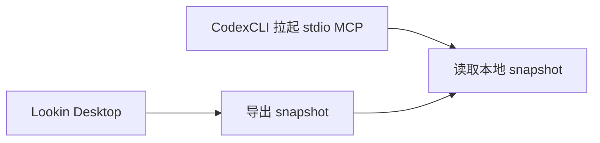
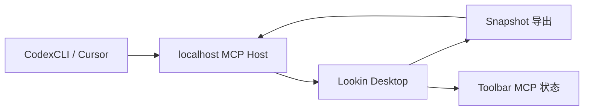

## Why

当前仓库已经具备“Lookin 导出本地 snapshot，独立 `lookin-mcp` 读取 snapshot”的 MVP，但这条链路仍然要求外部客户端自己拉起 `stdio` 进程。只要 Lookin 重启、外部进程退出或 `stdio` 会话丢失，MCP 连接就会中断，桌面端也无法直接向用户展示“当前 MCP 是否可用、是否有请求、snapshot 是否过期”。

更稳定的产品形态是让 Lookin Desktop 自己托管一个本地 MCP host，并在顶部 toolbar 中提供 MCP 状态入口。客户端只需要连接固定 localhost 地址，Lookin 负责服务生命周期、状态展示和 snapshot 新鲜度感知。

## What Changes

- 在 Lookin Desktop 中增加本地 MCP host，负责对外暴露固定 localhost MCP 地址，而不是要求外部客户端自行拉起 `stdio` server。
- 将现有 MCP tool 分发逻辑抽离为可复用核心，供 `stdio` 调试入口和桌面 HTTP host 共用。
- 在 Lookin 顶部 toolbar 增加 MCP 按钮，显示服务状态、snapshot 新鲜度、最近请求和最近错误。
- 增加 MCP host 生命周期管理，包括启动、停止、端口占用失败、Lookin 退出时释放和重启后恢复。
- 保持现有 snapshot reader 能力边界不变，继续以本地 snapshot 为数据源，不重新引入直连 iOS 端逻辑。

## Capabilities

### New Capabilities
- `lookin-desktop-mcp-host`：定义 Lookin Desktop 如何托管本地 MCP 服务、暴露固定地址并复用现有 snapshot reader 工具。
- `lookin-desktop-mcp-toolbar-status`：定义 Lookin 顶部 MCP 状态按钮、状态模型、popover 信息和用户操作入口。

### Modified Capabilities

## Impact

- 影响 Lookin 桌面端 toolbar 和窗口控制逻辑，例如 `LKStaticWindowController`、`LKWindowToolbarHelper` 及相关 UI 组件。
- 影响 `Sources/LookinMCPServer/` 的架构边界，需要把当前 `stdio` 入口下沉为可复用 core，再补一个桌面端本地 host transport。
- 影响 snapshot freshness 的定义，需要将“最近导出时间”和“最近请求时间”合并进用户可见状态。
- 需要明确固定 localhost 地址、端口冲突处理和 Lookin 重启后的客户端重连预期。
